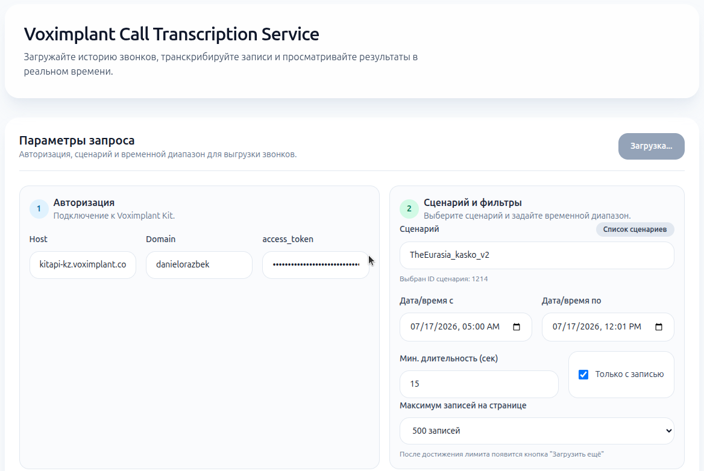
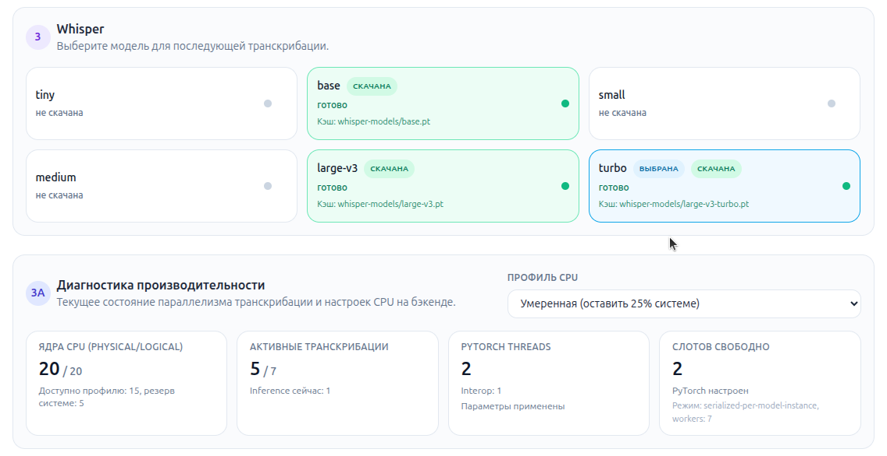
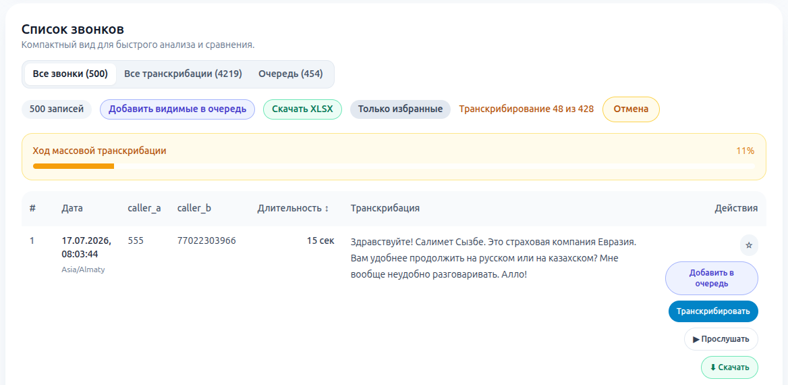

# Voximplant Kit Call History

## 1. О сервисе

Сервис помогает быстро выгружать историю звонков из Voximplant Kit, прослушивать записи и получать текстовые транскрибации с помощью локальной Whisper-модели.

Что умеет:
- загрузка звонков по фильтрам (период, сценарии и др.);
- транскрибация по одному звонку или пакетно через очередь;
- отображение статусов обработки в реальном времени;
- экспорт транскрипций;
- устойчивая обработка проблемных аудио (битые/слишком короткие записи помечаются как skipped, очередь не останавливается).

## 2. Интерфейс

Главная форма и фильтры


Выбор модели и упралвение произвоительностью


Список звонов


## 3. Архитектура

Технологический стек:
- Backend: FastAPI, WebSocket, httpx, openai-whisper, PyTorch, librosa;
- Frontend: React (Vite), Tailwind CSS;
- Хранение состояния: локальные JSON-файлы (очередь, кэш, расписания).

Минимальные требования:
- OS: Linux/macOS/Windows;
- Python: 3.10+;
- Node.js: 18+;
- ffmpeg (обязательно для декодирования/обработки аудио);
- CPU: от 8 ядер (рекомендуется 16+).


## 4. Инструкция по запуску

### 4.1 Backend

1. Перейти в папку backend:

```bash
cd /home/atabakov/Desktop/vscode/call-history-analyze/backend
```

2. Создать и активировать виртуальное окружение:

```bash
python3 -m venv venv
source venv/bin/activate
```

3. Установить зависимости:

```bash
pip install -r requirements.txt
```

4. Запустить сервер:

```bash
uvicorn main:app --host 0.0.0.0 --port 8000
```

Backend будет доступен по адресу:
- http://localhost:8000

### 4.2 Frontend

1. Перейти в папку frontend:

```bash
cd /home/atabakov/Desktop/vscode/call-history-analyze/frontend
```

2. Установить зависимости:

```bash
npm install
```

3. Запустить приложение:

```bash
npm run dev
```

Frontend будет доступен по адресу:
- http://localhost:5173

### 4.3 Быстрый сценарий использования

1. Откройте http://localhost:5173.
2. Укажите host, domain и access token Voximplant Kit.
3. Загрузите звонки за нужный период.
4. Добавьте записи в очередь и запустите транскрибацию.
5. Отслеживайте статусы queued/processing/done/failed/skipped в реальном времени.
